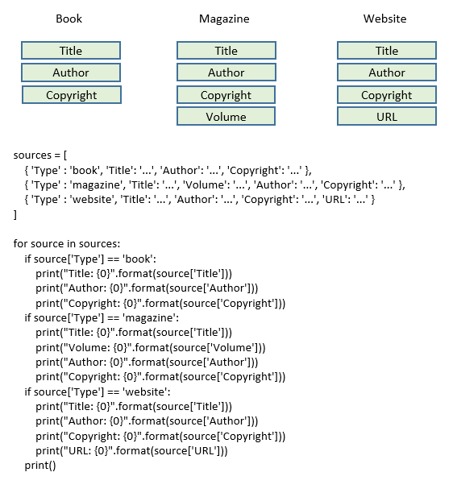
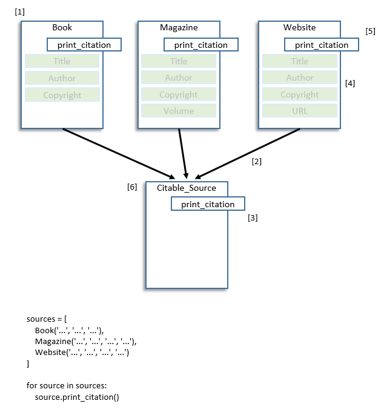

## Object Oriented Development aka OOP

#### What is OOP and why do I care?
+ A way of programming organized around objects/data rather than action/logic
+ Attempts to simplify larger application construction; because programming is hard

#### The three principles of Object Oriented Development are:

+ Encapsulation[4] hides stuff we don’t NEED to see
+ Abstraction[3] provides ways of manipulating things without knowing EXPLICITLY what they are
+ Polymorphism
    1. Allows things participating in a common collection to create SPECIFIC BEHAVIOR[5] 
    2. Allows for the creation of a SINGLE BEHAVIOR under many different circumstances[6]

#### The tools
+ Objects[1] allow us to group functionality based on real world things
+ Inheritance[2] allows us to extract COMMON behaviors[3] of things out into an abstract 
<br>
<br>

## Traditional Development

Here is an example of code you might use to handle the printing of different citation types in a word processor.
<br>
Notice that code is needed for each type of citation. While this doesn't seem like a lot of code, this basic pattern has to be duplicated throughout your code every time you handle a citation. Adding a new type of citation means that each block like this one would need to be changed throughout our application.



## Object Oriented Development

Using object oriented development we can keep the complexity of handling each type of citation out of the main logic of the application. Adding new types of citations becomes almost trivial.



[1] The Book citation type holds all the data and methods that work on it
<br>
[2] We use inheritance to indicate that a Book can be treated more abstractly as a citable_source
<br>
[3] We can leverage this abstractness to treat all our types of citations the same. They all provide a print_citation method
<br>
[4] Since each type of citation knows how to print itself, the rest of the application no longer needs to know about the specific data it holds.
<br>
[5] Each of our citation source types have different data so each must define a specialized version of the print_citation method
<br>
[6] With a base citation type we can now write methods that take citable_sources and handle the details internally.
<br>
<br>

## Some Terminology

Think of a <strong>class</strong> as a template we can use to make many <strong>objects</strong> of that type

#### Classes and their objects have both
+ Attributes (data)
+ Methods (actions that can work on data)

#### Think of it like a cookie cutter and cookies
+ The cookie cutter is the class
+ And the cookies it makes are the objects of that cookie cutter class
<BR><BR>

## A Simple Class

#### Defining a simple class
+ The class keyword identifies a class, name follows and ends with a colon
+ pass is a placeholder, a statement that does nothing but stops the interpreter from issuing an error message
    
#### Using a class to make an object
+ In the code below a default constructor (using no arguments) was created for us


```python
class Book:
    pass

book = Book()
print(book)
```

    <__main__.Book object at 0x0000025013C79208>
    

## Constructors, Attributes and Methods
+ We can create a constructor that takes any number of arguments<br>
+ Unfortunately we can only create one constructor (we'll solve this problem later when we talk about polymorphism)


```python
class Book:
    
    def __init__(self, title, author, copyright):
        self._title = title
        self._author = author
        self._copyright = copyright

    def print_citation(self):
        print("\"{0}\", {1}, {2}".format(self._title, self._author, self._copyright))
        print()

book = Book("Gone with the Wind", "Margaret Mitchell", 1936)
book.print_citation()
```

    "Gone with the Wind", Margaret Mitchell, 1936
    
    

#### Attributes
+ The class above defines 3 object attributes (_title, _author, and _copyright)
+ Because Python supports dynamic typing, their types are defined by what we put in them
+ Since the constructor defines them, we are guaranteed that they will exist by the time we use a Book object

#### Methods
+ The class defines 2 methods
    + The constructor \__init\__ (a special method)
    + A print method
    
#### Referencing class attributes and methods
+ All methods require the first argument be "self"
+ All references to methods and variables within a class are done through the self argument value

#### Python's Privacy Model
+ Underscores have a special meaning in Python either by convention or syntactically
    + Convention
        + Single underscores indicate that users are discouraged from using the function or attribute outside of the class itself
        + Double underscores indicate that users are <strong>strongly</strong> discouraged from using the function or attribute outside of the class itself
        + Python has no hard notion of public or private data
    + Syntactically
        + When you do certain things, Python will call these forbidden functions for you
        + In our example, Book() causes Python to call our constructor method named \__init\__
        
see special-method-names.htm
<br><br>

## Class Level Attributes and Methods


```python
class Book:

    _citation_type = "Book"
 
    def __init__(self, title, author, copyright):
        self._title = title
        self._author = author
        self._copyright = copyright

    def print_citation(self):
        print("\"{0}\", {1}, {2}".format(self._title, self._author, self._copyright))

    @classmethod
    def print_name(cls):
        print("Book class method called, class name is: {0}".format(cls.__name__))

    @staticmethod
    def print_citation_type():
        print("Book static method called")

book = Book("Gone with the Wind", "Margaret Mitchell", 1936)

# You can set a "private" attribute
Book._citation_type = "Magazine"
print(Book._citation_type)

# Class methods may be invoked on either the class or an object of that class
# And recieve a copy of the class they represent
Book.print_name()
book.print_name()

# Static methods may also be invoked on either the class or an object of that class
# But do not recieve a copy of the class they represent
Book.print_citation_type()
book.print_citation_type()
```

    Magazine
    Book class method called, class name is: Book
    Book class method called, class name is: Book
    Book static method called
    Book static method called
    

#### Class Attributes
+ _citation_type is a class attribute (there is only one value for the class and any objects created from it)
+ _citation_type is "private" (but you can still set it and get its value! But don't)

#### Class Methods
+ print_name is a class method
+ Class methods may be invoked on either the class or an object of that class
+ Class methods receive a reference to the class they belong to when called (cls)

#### Static Class Methods
+ print_citation_type is a static method
+ Static methods may be invoked on either the class or an object of that class
+ Static methods <strong>do not</strong> receive a reference to the class they belong to when called

#### Decorators (what is that @ thingy)
+ Decorators provide the ability to use Aspect Oriented Programming
+ Decorators are used to wrap one thing with another
+ In these two cases the build-in decorators @classmethod and @staticmethod wrap the methods they decorate
<br><br>


## Inheritance


```python
class Citable_Source:

    __next_number = 1
    
    def __init__(self):
        self._number = Citable_Source.__next_number
        Citable_Source.__next_number += 1
        
    def number(self):
        return self._number

    # Base class implementation, this gets called it the deriving class does not define it
    def print_citation(self):
        print("[{0}]".format(self.number()))

# Unknown inherits from Citable_Source
class Unknown(Citable_Source):
    # Default base class constructor used since one was not defined
    pass
    
class Book(Citable_Source):
    
    def __init__(self, title, author, copyright):
        # Base class constructor called explicitly
        Citable_Source.__init__(self)
        self._title = title
        self._author = author
        self._copyright = copyright

    def print_citation(self):
        print("[{0}] \"{1}\", {2}, {3}".format(super().number(), self._title, self._author, self._copyright))
        
class Magazine(Citable_Source):

    def __init__(self, title, author, volume, copyright):
        Citable_Source.__init__(self)
        self._title = title
        self._author = author
        self._volume = volume
        self._copyright = copyright

    def print_citation(self):
        print("[{0}] \"{1}\", {2}, {3}, {4}".format(self.number(), self._title, self._volume, self._author, self._copyright))
        
unknown = Unknown()
book = Book("Zen and the Art of Motorcycle Maintenance", "Robert M. Pirsig", 1974)
magazine = Magazine("DIY: Quinoa, Food or Fashion", "I. M. Hungry", "Bon Appetit, 47", 2018)

unknown.print_citation()
book.print_citation()
magazine.print_citation()
```

    [1]
    [2] "Zen and the Art of Motorcycle Maintenance", Robert M. Pirsig, 1974
    [3] "DIY: Quinoa, Food or Fashion", Bon Appetit, 47, I. M. Hungry, 2018
    

#### Highlights

+ Inheritance is indicated in a class definition by enclosing the base class name in parenthesis following the class name
Unknown, Book, and Magazine all inherit from Citable_Source.

+ The default base class constructor will be called unless it is explicitly called when inheriting from a base class

+ Base class attributes and methods can be accessed via either the self variable or by using the function super()

+ Using a base class allows us to create default behavior. In this case, the Unknown class does not provide a print_citation but instead uses the default one defined in the Citable_Source class
<br><br>

## Duck Typing

<strong>If it walks like a duck and swims like a duck and quacks like a duck, it's a duck!</strong>


```python
class Unknown:

    def print_citation(self):
        print("I am Unknown")
    
class Book:
    
    def print_citation(self):
        print("I am Book")
        
class Magazine:

    def print_citation(self):
        print("I am Magazine")

citations = [
    Unknown(),
    Book(),
    Magazine()
]

for citation in citations:
    citation.print_citation()

```

    I am Unknown
    I am Book
    I am Magazine
    

#### Highlights

+ citations is a list of our citations, each citation is constructed in-place
+ The list doesn't care that the objects aren't of the same class type
+ Because Python is dynamically typed, it doesn't care about the class of each object in citations, ever
+ I can create a new class that acts like a citation just by creating the citation within it 

<strong>If it walks like a duck and swims like a duck and quacks like a duck, it's a duck!</strong>
<br><br>

## Leveraging the Special Method Names

You may have seen a section of code that looked something like this:

```
with open("myfile.txt", "r") as f:
    f.read()
```

#### What is the "with" doing?
+ When we use a resource, in this case an open file, we like to close it when we are done using it
+ The "with" construct allows the file object to detect when the file f goes out of scope (leaves the nested area) so it can close it for us

You may think that this syntax is possible because file.open is part of the Python language but it actually possible because there is code in the Python distribution that leverages a set of well known method names.

To see how this works, let's create something similar. In our case we will create a time that when it leaves scope it writes the elapsed time.
<br><br>

#### Classes that can be used in a with block

(From the special-method-names.htm page)

A with block defines a runtime context; you “enter” the context when you execute the with statement, and you “exit” the context after you execute the last statement in the block.

<table style="width:100%">
<tr>
    <th><p align="left">You want...</p></th>
    <th><p align="left">So You Write...</p></th>
    <th><p align="left">And Python Calls...</p></th>
</tr>
<tr>
    <td><p align="left">do something special when entering a WITH block</p></td>
    <td><p align="left">with x:</p></td>
    <td><p align="left">x.__enter__()</p></td>
</tr>
<tr>
    <td><p align="left">do something special when leaving a WITH block</p></td>
    <td><p align="left">with x:</p></td>
    <td><p align="left">x.__exit___(exc_type, exc_value, traceback)</p></td>
</tr>
</table>


<br><br>
#### An example


```python
import sys
import time

class Timer:
    
    def __int__(self):
        self.start = 0
        self.end = 0
    
    # The special method names
    def __enter__(self):
        self.start = time.time()
        return self

    def __exit__(self, type, value, traceback):
        print("Completed in {0} seconds".format(time.time() - self.start))

# Leveraging the special method names
with Timer() as t:
    time.sleep(2)
    
# Which is the same as doing it explicitly
timer = Timer()
timer.__enter__()
time.sleep(2)
timer.__exit__(None, None, None)

```

    Completed in 2.004647731781006 seconds
    Completed in 2.005380868911743 seconds
    

#### Why is the first one better?
+ It's Shorter
+ Because of the indentation it's clearer what the scope of the Timer is
+ The user can't forget to __exit__ the Timer (which makes scarce resource management easier)

## Polymorphism

We missed one of the subparts of the principle of encapsulation, see the bold:
<br><br>
The three principles of Object Oriented Development are:

+ Encapsulation[4] hides stuff we don’t NEED to see
+ Abstraction[3] provides ways of manipulating things without knowing EXPLICITLY what they are
+ Polymorphism
    + Allows things participating in a common collection to create SPECIFIC BEHAVIOR[5]
    + <strong>Allows for the creation of a SINGLE BEHAVIOR under many different circumstances</strong>

#### Using \*args and **kwargs
+ \*args and **kwargs are mostly used in function definitions
+ \*args and **kwargs allow you to pass a variable number of arguments to a function
+ Variable means that you do not know beforehand how many arguments are passed to your function
+ \*args is used to send a non-keyworded variable length argument list to a function 
+ **kwargs is used to send a keyword:value variable length argument list to a function
<br><br><br>
Here’s an example to help you get the idea:

#### Calling a function using \*args and **kwargs


```python
def test_args_kwargs(arg1, arg2, arg3):
    print("arg1:", arg1)
    print("arg2:", arg2)
    print("arg3:", arg3)
    
# First with *args
args = ("two", 3, 5)
test_args_kwargs(*args)
```

    arg1: two
    arg2: 3
    arg3: 5
    


```python
# Yes this is the same as
test_args_kwargs("two", 3, 5)
```

    arg1: two
    arg2: 3
    arg3: 5
    


```python
# Now with **kwargs:
kwargs = {"arg3": 3, "arg2": "two", "arg1": 5}
test_args_kwargs(**kwargs)

# Notice that order is not important
```

    arg1: 5
    arg2: two
    arg3: 3
    


```python
# And this is how we handle the variable arguments on the function implementation side
def test_var_args(*argv):
    i = 1
    for arg in argv:
        print("arg{0}: {1}".format(i, arg))
        i += 1

test_var_args("two", 3, 5)

# You can use normal parameters too but they must be before *argv
```

    arg1: two
    arg2: 3
    arg3: 5
    


```python
def test_var_kwargs(**kwargs):
    for key, value in kwargs.items():
        print("{0}: {1}".format(key, value))
        
kwargs = {"arg3": 3, "arg2": "two", "arg1": 5}
test_var_kwargs(**kwargs)       
```

    arg3: 3
    arg2: two
    arg1: 5
    

#### Constructor polymorphism

And now we can create constructors that handle more than one set of function arguments


```python
class Book:

    def __init__(self, **kwargs):
        self._title = kwargs['title'] if 'title' in kwargs else "None"
        self._author = kwargs['author'] if 'author' in kwargs else "None"
        self._copyright = kwargs['copyright'] if 'copyright' in kwargs else "None"

    def print_citation(self):
        print("\"{0}\", {1}, {2}".format(self._title, self._author, self._copyright))

book1 = Book(title = "Gone with the Wind", author = "Margaret Mitchell", copyright = 1936)
book2 = Book(title = "Gone with the Wind")
book1.print_citation()
book2.print_citation()
```

    "Gone with the Wind", Margaret Mitchell, 1936
    "Gone with the Wind", None, None
    


```python

```
